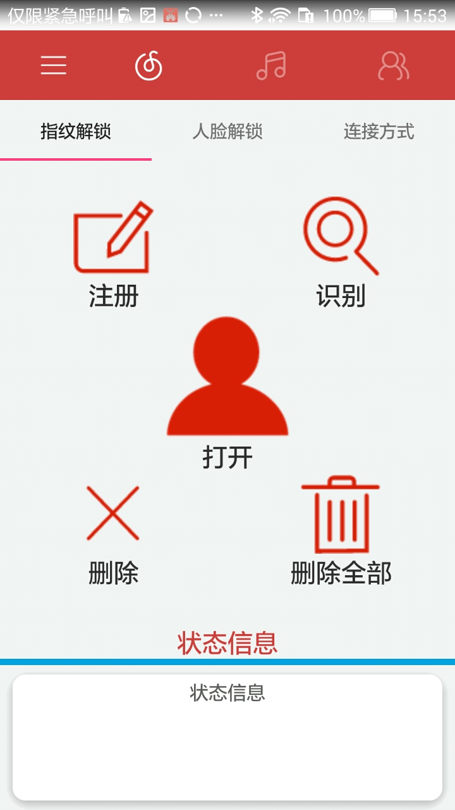

#  安防卫士
 该项目用到了Material Desin和一些主流框架

## Screenshots

## Features 特性
* 遵循Material Desin设计风格
* Rxjava+Retrofit2网络请求,并进行封装错误可以进行统一处理
* Dagger2将M层注入P层,无需new,直接调用对象
* 抽取了BaseActivity和BaseFragment
* BaseRecyclerViewAdapterHelper+RecyclerView完成下拉刷新，上拉加载更多。
* Glide做图片的处理和加载

## About me: 
* QQ: 2319152336